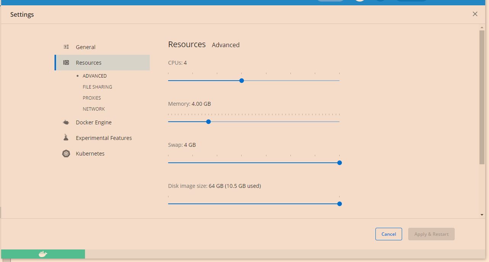

# 脚手架基础部件docker支持项目 (进行中)

---

## 该项目主要用于脚手架项目的开发和调试的本地环境

## Docker参考配置(配置低了可能部分容器启动失败)



## 使用方法

1. 执行脚本stop_and_start_docker.sh

2. 本来是应该写脚本来添加db和用户的,因为mongoDB脚本不熟,未能完成.
   
   所以请手动创建database=scaffold,username=scaffold,password=scaffold，并给用户scaffold赋予数据库scaffold权限. (这块脚本会尽快补上 TODO)

---

## 脚本说明

1. docker_pull.sh: docker容器比较多, start_docker_XXX.sh脚本会比较慢,用该脚本先下载所以docker 
2. stop_and_start_docker.sh  先停止,删除上次运行docker的文件,重新启动docker
3. start_docker.sh  启动docker
4. stop_docker.sh  停止docker
5. shutdown_and_clean_docker.sh 停止docker并且清空

## 配置参数

1. 数据库mysql 8:  (如果启动mysql5.7参考docker-compose.yml中mysql5.7相关) (单实例)
   
   用户名:micro_server_demo
   
   密码:micro_server_demo
   
   ip:127.0.0.1
   
   端口:3308

2. zookeeper: (3台最小的集群)
   
   ip:127.0.0.1
   
   zoo1 port:2181
   
   zoo2 port:2182
   
   zoo3 port:2183
   
   GUI工具(直接运行): tools/zookeeper/ZooInspector/zookeeper-dev-ZooInspector.jar

3. dubbo admin 
   
   [http://127.0.0.1:8082/](http://127.0.0.1:8082/)
   
   用户名: root
   
   密码 : root
   
   ps:  registry.address , config-center, metadata-report.address三类数据存储到了一个集群中(zoo1, zoo2, zoo3)

4. Redis:todo (单点)
   
    ip:127.0.0.1
   
    port:6389
   
   GUI工具(需要安装): tools/redis/redis-desktop-manager-0.9.5.exe

5. Kafak:todo
   
   ip:127.0.0.1
   
   listeners port:9092
   
   注册的zk地址是127.0.0.1:2181
   
   GUI工具(需要安装): tools/kafka/kafkatool_64bit.exe

6. elasticsearch:todo
   
    http://127.0.0.1:9200

7. kibana:todo
   
    http://127.0.0.1:5601

8. mongoDB:
   
   admin http://127.0.0.1:8081/
   
   ip: 127.0.0.1
   
   port: 27017
   
   ROOT_USERNAME: root
   
   ROOT_PASSWORD: example

9. RabbitMQ
   端口比较多看看配置吧!
   控制台: (user/bitnami)
   http://127.0.0.1:15672/

10. activemq
    spring.activemq.broker-url=tcp://127.0.0.1:61616
    控制台: (admin/admin)
    http://127.0.0.1:8161/admin/

## Docker端口问题

1. Windows平台查看端口被占用 
   
   netstat -ano |  findstr 8080               <--   查看占用的进行
   
   tasklist|findstr "6624"                        <--  根据进程号查询,或者直接找PID

2. 系统保留端口问题
   
   查询端口是否被排除
   netsh interface ipv4 show excludedportrange protocol=tcp
   
   修改网络规则

3. 重启
   dism.exe /Online /Disable-Feature:Microsoft-Hyper-V 

4. 启动后
   netsh int ipv4 add excludedportrange protocol=tcp startport=<your port> numberofports=1

5. 第二步操作后继续第三步操作,然后重启
   dism.exe /Online /Enable-Feature:Microsoft-Hyper-V /All

本次用到的一些端口

```powershell
netsh int ipv4 add excludedportrange protocol=tcp startport=9200 numberofports=1
netsh int ipv4 add excludedportrange protocol=tcp startport=27017 numberofports=1
netsh int ipv4 add excludedportrange protocol=tcp startport=8081 numberofports=1
netsh int ipv4 add excludedportrange protocol=tcp startport=3308 numberofports=1
netsh int ipv4 add excludedportrange protocol=tcp startport=6389 numberofports=1
netsh int ipv4 add excludedportrange protocol=tcp startport=2181 numberofports=1
netsh int ipv4 add excludedportrange protocol=tcp startport=2182 numberofports=1
netsh int ipv4 add excludedportrange protocol=tcp startport=2183 numberofports=1
netsh int ipv4 add excludedportrange protocol=tcp startport=8082 numberofports=1
netsh int ipv4 add excludedportrange protocol=tcp startport=9092 numberofports=1
netsh int ipv4 add excludedportrange protocol=tcp startport=8161 numberofports=1
netsh int ipv4 add excludedportrange protocol=tcp startport=61616 numberofports=1
netsh int ipv4 add excludedportrange protocol=tcp startport=61613 numberofports=1
netsh int ipv4 add excludedportrange protocol=tcp startport=5601 numberofports=1
netsh int ipv4 add excludedportrange protocol=tcp startport=7001 numberofports=5
netsh int ipv4 add excludedportrange protocol=tcp startport=15672 numberofports=1
netsh int ipv4 add excludedportrange protocol=tcp startport=5672 numberofports=3
netsh int ipv4 add excludedportrange protocol=tcp startport=15692 numberofports=2
```
